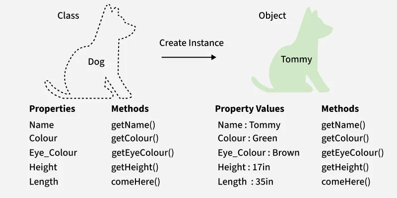
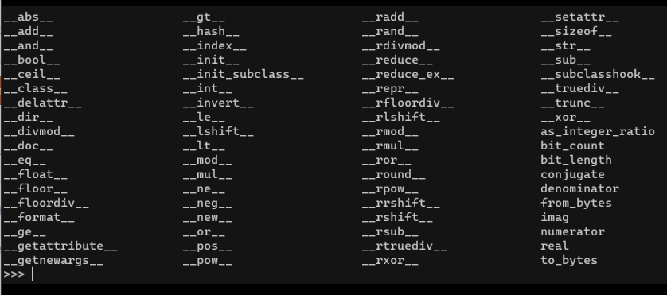
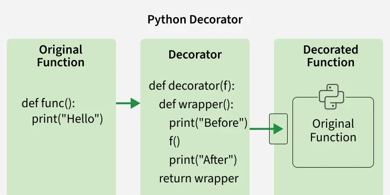
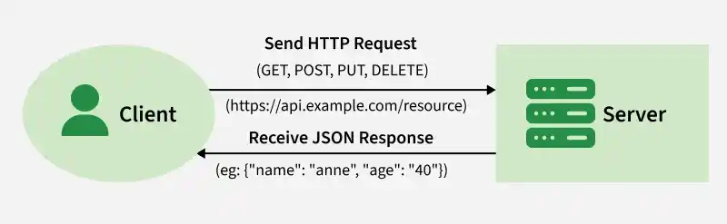

# M3C6

## ¿Para qué usamos Clases en Python?

Las clases se utilizan para agrupar datos y funcionalidades. Al crear una nueva clase, se crea un nuevo _tipo_ de objeto, lo que permite crear nuevas _instancias_ de ese tipo. Cada instancia de clase puede tener atributos asociados para mantener su estado. Las instancias de clase también pueden tener métodos (definidos por su clase) para modificar su estado.

La programación orientada a objetos (POO) de Python permite modelar entidades del mundo real en código, lo que hace que los programas sean más organizados, reutilizables y fáciles de mantener. Al agrupar datos y comportamientos relacionados en una sola unidad, las clases y los objetos ayudan a escribir código más limpio y lógico para todo, desde pequeños scripts hasta grandes aplicaciones.

Utilizamos una clase en Python como plantillas definidas por el usuario para crear objetos. Como antes mencionamos, agrupan datos y funciones, lo que facilita su administración y uso. Al crear una nueva clase, definimos un nuevo tipo de objeto. Podemos crear múltiples instancias de este tipo de objeto.

<figure><figcaption></figcaption></figure>

Para crear clases utilizamos **la palabra clave class** . Los atributos son variables definidas dentro de la clase y representan sus propiedades. Se puede acceder a los atributos mediante **el operador** punto (p. ej., MyClass.my\_attribute).

```
# define a class
class Dog:
    sound = "bark"  # class attribute
```

Las clases contienen **objetos**, lo cual podemos definir como la instancia específica de una clase. Contiene su propio conjunto de datos (variables de instancia) y puede invocar métodos definidos por su clase. Se pueden crear varios objetos a partir de la misma clase, cada uno con sus propios atributos únicos.

```
class Dog:
    sound = "bark"

dog1 = Dog() # Creating object from class
print(dog1.sound) # Accessing the class
```

**El atributo sound** es un atributo de clase. Se comparte entre todas las instancias de la clase Dog, por lo que se puede acceder directamente a él a través de la instancia **dog1** .

## ¿Qué método se ejecuta automáticamente cuando se crea una instancia de una clase?

Cuando se crea una instancia de una clase, automáticamente se ejecuta el método **\_\_init\_\_()**.

El método **\_\_init\_\_()** actúa como constructor en Python y se utiliza para inicializar los atributos del objeto con los valores proporcionados al crearlo.

```
class Dog:
    species = "Canine"  # Class attribute

    def __init__(self, name, age):
        self.name = name  # Instance attribute
        self.age = age  # Instance attribute

# Creating an object of the Dog class
dog1 = Dog("Buddy", 3)

print(dog1.name)  
print(dog1.species)
```

En este código, _self_ se refiere al objeto actual y se utiliza para almacenar datos dentro de él. Dog("Buddy", 3) crea un objeto y pasa valores a **init**(). Las sentencias self.name y self.age almacenan el nombre y la edad del objeto. Posteriormente, dog1.name accede al atributo de instancia del objeto y dog1.species accede al atributo de clase compartido.

Otro método normalmente utilizado es el **método \_\_str\_\_**.

El método \_\_str\_\_ de Python permite definir una representación de cadena personalizada de un objeto. De forma predeterminada, al imprimir un objeto o convertirlo en una cadena mediante str(), Python utiliza la implementación predeterminada, que devuelve una cadena como <\_\_main\_\_.ClassName object at 0x00000123>.

Veamos un ejemplo del uso del método **\_\_str\_\_()** para proporcionar una salida de cadena legible para un objeto:

```
class Dog:
    def __init__(self, name, age):
        self.name = name
        self.age = age

    def __str__(self):
        return f"{self.name} is {self.age} years old."
dog1 = Dog("Buddy", 3)
dog2 = Dog("Charlie", 5)

print(dog1)  
print(dog2)
```

La implementación de **str** se define como un método en la clase Dog. Utiliza el parámetro "self" para acceder a los atributos de la instancia (nombre y edad). Conseguimos una salida legible al llamar print(dog1), Python usa automáticamente el método **str** para obtener una representación de cadena del objeto. Sin **str**, llamar a print(dog1) produciría algo como <**main**.Dog object at 0x00000123>.

## ¿Qué es un método dunder?

Los métodos dunder de Python son métodos especiales con guiones bajos dobles \_\_ que permiten la sobrecarga de operadores y el comportamiento de objetos personalizados.

Los métodos dunder con los que se puede trabajar son los siguientes:

<figure><figcaption></figcaption></figure>

Además del **\_\_init\_\_**, uno de los métodos más utilizados es el **\_\_str\_\_**. El método **\_\_str\_\_** de Python permite definir una representación de cadena personalizada de un objeto. De forma predeterminada, al imprimir un objeto o convertirlo en una cadena mediante str(), Python utiliza la implementación predeterminada, que devuelve una cadena como <\_\_main\_\_.ClassName object at 0x00000123>.

Veamos un ejemplo del uso del método **\_\_str\_\_()** para proporcionar una salida de cadena legible para un objeto:

```
class Dog:
    def __init__(self, name, age):
        self.name = name
        self.age = age

    def __str__(self):
        return f"{self.name} is {self.age} years old."
dog1 = Dog("Buddy", 3)
dog2 = Dog("Charlie", 5)

print(dog1)  
print(dog2)
```

**Explicación:**

* **Implementación de \_\_str\_\_:** Se define como un método en la clase Perro. Utiliza el parámetro "self" para acceder a los atributos de la instancia (nombre y edad).
* **Salida legible:** Al llamar a print(dog1), Python usa automáticamente el método \_\_str\_\_ para obtener una representación de cadena del objeto. Sin \_\_str\_\_, llamar a print(dog1) produciría algo como <\_\_main\_\_.Dog object at 0x00000123>.

## ¿Qué es un decorador de python?

En Python, los decoradores son una forma flexible de modificar o extender el comportamiento de funciones o métodos, sin cambiar su código real.

* Un decorador es esencialmente una función que toma otra función como argumento y devuelve una nueva función con funcionalidad mejorada.
* Los decoradores se utilizan a menudo en escenarios como registro, autenticación y memorización, lo que nos permite agregar funcionalidad adicional a funciones o métodos existentes de una manera limpia y reutilizable.

<figure><figcaption></figcaption></figure>

Ejemplo:&#x20;

```
class Garage:
  def __init__(self, size):
    #   Protects the size attribute
    self._size = size
    self.cars = []

  # decorator 
  @property
  def size(self):
    return self._size

  def open_door(self):
    return "The door opens"
```

## ¿Qué es una API?

Una API REST (API de Transferencia de Estado Representacional) permite la comunicación entre el cliente y el servidor mediante HTTP. Intercambia datos, generalmente en formato JSON, mediante protocolos web estándar.

<figure><figcaption></figcaption></figure>

* Utiliza métodos HTTP como GET, POST, PUT, PATCH y DELETE.
* El cliente envía solicitudes a los puntos finales del servidor (URL).
* El servidor devuelve respuestas como JSON, XML, HTML o imágenes.
* Asigna métodos HTTP a operaciones CRUD (Crear, Leer, Actualizar, Eliminar).

## ¿Cuáles son los tres verbos de API?

Los tres verbos más utilizados dentro de API son GET, POST y DELETE. Los explicaremos a continuación.

#### Método GET

El método HTTP GET recupera un recurso. En caso de éxito, devuelve datos (generalmente JSON o XML) con el código 200 OK; en caso de error, suele devolver el código 404 "No encontrado" o el código 400 "Solicitud incorrecta".

```
GET/usuarios/123
```

#### Método POST

El método POST crea nuevos recursos. Si se ejecuta correctamente, devuelve 201 Created con un encabezado Location que apunta al nuevo recurso.

```
POST /usuarios 
{ 
  "nombre": "Anne", 
  "correo electrónico": "gfg@ejemplo.com" 
}
```

#### Método DELETE

Se utiliza para eliminar un recurso identificado por una URI. Si la eliminación se realiza correctamente, se devuelve el estado HTTP 200 (OK) junto con el cuerpo de la respuesta.

```
DELETE/usuarios/123
```

## ¿Es MongoDB una base de datos SQL o NoSQL?

MongoDB **es** una base de datos NoSQL.&#x20;

MongoDB almacena objetos de datos en **colecciones** y **documentos** en lugar de las tablas y filas que se utilizan en las bases de datos relacionales tradicionales. Las colecciones comprenden conjuntos de documentos, que son equivalentes a tablas en una base de datos relacional. Los documentos consisten en pares clave-valor, que son la unidad básica de datos en MongoDB.

La estructura de un documento se puede cambiar simplemente añadiendo campos nuevos o eliminando los existentes. Los documentos pueden definir una clave principal como identificador único y los valores pueden ser una variedad de tipos de datos, incluidos otros documentos, matrices y matrices de documentos.

En MongoDB los datos se almacenan en documentos con formato similar a JSON (realmente BSON).

Ejemplo de documento en MongoDB:

```
</>JSON
{
  "title": "My first guide",
  "content": "Some content"
}
```

MongoDB no utiliza el lenguaje SQL. Las bases de datos SQL usan consultas como:

```
</>SQL
SELECT * FROM books;
```

Mientras que MongoDB utiliza:

```
</>JavaScript
db.guides.find()
```

A su vez, MongoDb no utiliza un sistema rígido, por lo que **no necesitas definir un esquema rígido previamente**. Cada documento puede tener campos diferentes. Ej:&#x20;

```
</> JSON
{
  "title": "Book 1",
  "content": "Some text"
}
{
  "title": "Book 2",
  "autkhor": "Robbie Williams"
}
```

## ¿Qué es Postman?

Postman es una potente herramienta de desarrollo y prueba de API que simplifica el proceso de creación, prueba y gestión de API. Permite a los desarrolladores enviar solicitudes HTTP, analizar respuestas, automatizar flujos de trabajo y colaborar eficientemente. Gracias a su compatibilidad con múltiples métodos de autenticación, formatos de cuerpo de solicitud y pruebas automatizadas, Postman se ha convertido en una de las herramientas más populares para el desarrollo de API modernas.

* Admite GET, POST, PUT, PATCH y DELETE para una interacción API integral.
* Envía datos en formato de datos de formulario, codificados en URL, sin procesar (JSON, XML, texto) o binario.
* Contiene un soporte integrado para claves API, OAuth, tokens de portador y autenticación básica.
* Organiza las solicitudes de API relacionadas para una mejor colaboración y gestión de proyectos.
* Escribe scripts de prueba en JavaScript y programe ejecuciones para una integración continua.
* Genera y comparte documentos API directamente desde solicitudes y colecciones.
* Reutiliza y comparte espacios de trabajo sin empezar desde cero.

En síntesis, gracias a Postman podemos simplificar el envío y la recepción de solicitudes, la prueba de API y la interacción con servidores.

## ¿Qué es el polimorfismo?

El polimorfismo en Python se refiere a la **capacidad de diferentes objetos de responder a la misma llamada a un método o función de maneras específicas para sus tipos individuales**. El término proviene de las palabras griegas «poly» (muchos) y «morphos» (formas), que literalmente significan «muchas formas». El polimorfismo es un concepto fundamental en la programación orientada a objetos (POO) que permite a los programadores usar una única interfaz con diferentes formas subyacentes.

En Python, el polimorfismo permite escribir código más flexible y reutilizable al permitir que objetos de diferentes clases se traten como objetos de una superclase común. Este principio fundamental de la programación orientada a objetos (POO) hace que el código sea más modular, extensible y fácil de mantener.

```
class Bird:
  def sound(self):
    return "Tweet"

class Dog:
  def sound(self):
    return "Bark"

def make_sound(animal):
  print(animal.sound())

# Create objects
bird = Bird()
dog = Dog()

# Same function call, different behaviors
make_sound(bird)  # Output: Tweet
make_sound(dog)   # Output: Bark
```

A continuación veremos diferentes tipos de polimorfismo.&#x20;

#### Duck Typing

El tipado de pato es un concepto relacionado con el tipado dinámico, donde el tipo o la clase de un objeto es menos importante que los métodos que define. Su nombre proviene del dicho: «Si camina como un pato y grazna como un pato, probablemente sea un pato».

```
class Duck:
  def swim(self):
    return "Duck swimming"

  def fly(self):
    return "Duck flying"

class Airplane:
  def fly(self):
    return "Airplane flying"

def fly_test(entity):
  print(entity.fly())

# Create objects
duck = Duck()
airplane = Airplane()

# Same function works with different objects
fly_test(duck)      # Output: Duck flying
fly_test(airplane)  # Output: Airplane flying

```

En este ejemplo, la `fly_test()`función funciona con cualquier objeto que tenga un `fly()`método, independientemente de su tipo. Este es un ejemplo típico de tipado de pato.

#### Anulación de datos&#x20;

La sobreescritura de métodos ocurre cuando una subclase proporciona una implementación específica de un método ya definido en su clase padre. Esta es una de las formas más comunes de polimorfismo en Python.

```
class Animal:
  def speak(self):
    return "Animal makes a sound"

class Cat(Animal):
  def speak(self):
    return "Meow"

class Cow(Animal):
  def speak(self):
    return "Moo"

# Create objects
animal = Animal()
cat = Cat()
cow = Cow()

# Same method name, different behaviors
print(animal.speak())  # Output: Animal makes a sound
print(cat.speak())     # Output: Meow
print(cow.speak())     # Output: Moo

```

En este ejemplo, ambas clases `Cat` y  `Cow` anulan el método `speak()` de su clase padre `Animal`.

#### Sobrecarga de operadores

La sobrecarga de operadores es una característica de Python que permite que un mismo operador tenga diferentes significados según el contexto. Por ejemplo, este `+`operador realiza sumas aritméticas con números, pero concatenaciones con cadenas.

```
class Point:
  def __init__(self, x, y):
    self.x = x
    self.y = y

  def __add__(self, other):
    return Point(self.x + other.x, self.y + other.y)

  def __str__(self):
    return f"Point({self.x}, {self.y})"

# Create Point objects
p1 = Point(1, 2)
p2 = Point(3, 4)

# Using the + operator on Point objects
p3 = p1 + p2
print(p3)  # Output: Point(4, 6)

```

En este ejemplo, hemos sobrecargado el `+`operador de la `Point`clase implementando el método `__add__`especial.

#### Sobrecarga de funciones y métodos

A diferencia de otros lenguajes de programación orientada a objetos, Python no admite la sobrecarga tradicional de funciones o métodos, donde se definen varios métodos con el mismo nombre pero con diferentes parámetros. Sin embargo, Python logra una funcionalidad similar mediante parámetros predeterminados y argumentos de longitud variable.

```
def calculate_area(length, width=None):
  if width is None:
    return length * length
  return length * width

# Using the function with different arguments
print(calculate_area(5))      # Output: 25 (square)
print(calculate_area(4, 6))   # Output: 24 (rectangle) 

```

Este ejemplo muestra cómo una sola función puede manejar diferentes tipos de entradas, lo que demuestra un comportamiento polimórfico.

